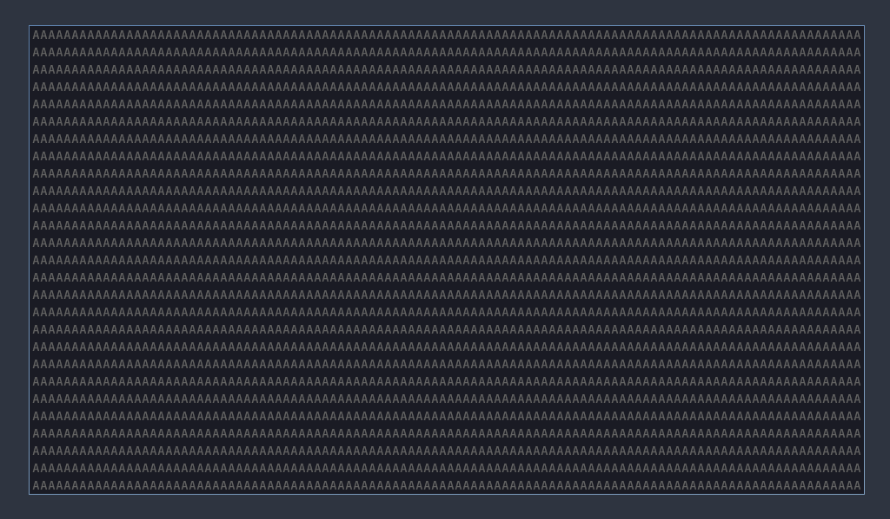

# ccanvas-solid

Fills your screen with a single character - used for testing and debugging.



## Usage

Make sure `ccanvas-solid` is installed. For example using the `cargo install` command.

```sh
cargo install --git https://github.com/ccanvas/ccanvas-solid
```

To add it to your program, simply load it in.

```rs
client
    .spawn(
        "solid".to_string(),
        "ccanvas-solid".to_string(),
        Vec::new()
    )
    .await;
```

By default it will use `#` as the fill character, to use a custom fill character, use the `CHAR` environment variable as so.

```rs
client
    .spawn_with_env(
        "solid".to_string(),
        "ccanvas-solid".to_string(),
        Vec::new(),
        BTreeMap::from([("CHAR".to_string(), "A".to_string())]),
    )
    .await;
```
